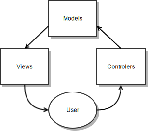
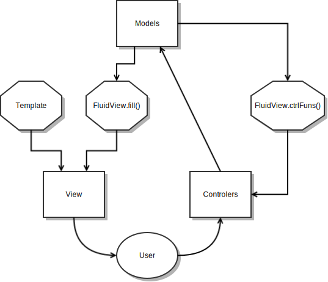
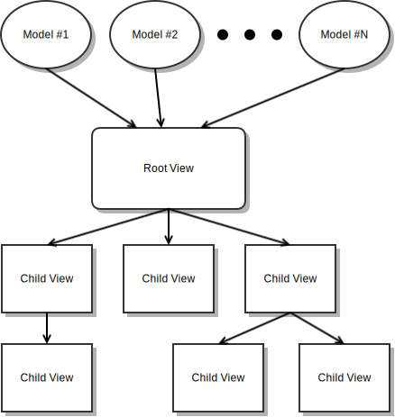

Fluid.js
========

Fluid.js is a JavaScript Model View Controller (MVC) designed to make it
easier for webapps to have smooth transitions and animations.

Fluid.js takes heavy inspiration from
[Backbone.js](http://http://backbonejs.org/), and is similar in usage.
However, where as MVCs like Backbone.js discard old content whenever the 
models change, Fluid.js simply updates the old content.  This allows CSS
transitions & animations to be incorporated more easily.

### Features

Fluid.js is:

*	Lightweight (just under 10K minified, 3.5K if also zipped, only
	dependency is [jQuery](http://http://jquery.com/))
*	Easy to use (feels similar to Backbone.js)
*	Highly extensible
*	Fast (automatically memoizes view updates)

### Why make another MVC?

The animations and smooth transitions of native apps are one of the major
factors that give them their fun, playful feel.  Webapps, in contrast,
generally lack animations and have jarring, instantaneous transitions.  This
is a major reason why webapps, even ones which are well designed and look
beautiful in screen shots, still feel clunky and low-tech when you actually
use them.

This is totally unacceptable.  The WebKit team introduced CSS transitions
[7 years ago](https://www.webkit.org/blog/138/css-animation/).  More complex
animations using `keyframes` date back five years.  These CSS features are
actually perfectly designed to give webapps the missing dynamic feel of a
native app.  Yet, these features are barely used.  The reason has to do with
the way that most of our webapps are rendered.

Generally, when our models change, the MVC will discard all the stale content
from the DOM, and replace it with fresh content.  While this certainly works,
and is easy to think about from a programing POV, it also makes transitions
incredibly difficult.  This is because the browser cannot smooth out the
transition from old content to new when the old content is simply being
replaced.  Instead, for these CSS features to be truly effective, the old DOM
content needs to be updated instead of replaced.

The goal of this project is to build an MVC that works by updating content
instead of replacing it, but from a programing POV still *feels* like you're
creating the content from scratch.

Overview
========

Fluid.js follows the MVC model:



However, much like Backbone.js, the line between its views and it's
controllers is blurry.  A more complete diagram of how Fluid.js works might
look like this:



The `fill()` function takes information which was passed to the model and
uses it to fill in the template (more on this later).  `ctrlFuns()` doesn't
actually refer to any specific function, but instead refers to the fact that
a variety of functions might be used to attach events to the elements of the
view (more on that later as well).

Information in Fluid.js follows the following pattern:



As you can see, models pass there information into some Root View, and that
Root View then passes some information along to its children, which repeat
the process recursively.  The Root View is attached directly to the DOM,
where as the Child Views are just attached to their parent.

Example
=======

While Fluid.js is similar to Backbone.js once you understand it, it is fairly
opaque and can be difficult to understand in the abstract.  As such, we have
provided [an example](http://sjelin.github.io/FluidJS) which you can look at
regularly when reading this document.

Models
======

Models in Fluid.js are (by default) dumb containers.  More complex
functionality can be added through [extensions](#extensions), though even so
they will probably never be as sophisticated as models in something like
Backbone.js.  A new model is declared as follows:

```js
	var model = Fluid.newModel(init);
```

Once this has been done, `model` will have the following methods:

```js
	model.get(); //Gets the current value of the model
	model.set(val); //Sets & returns the value of the model
	model.listen(fun); //Sets up fun to be called whenever the model changes
	model.alert(); //Calls all listening functions
	model.sub(prop); //Creates a submodel.  See details below
```

It is worth noting that the listeners are called in the order they are
installed.  So if you want to add some sort of post-processing to an model,
simply add a listener directly after declaring the model.

#### Submodels

Let's say you create a model `person` for an person

```js
	var person = Fluid.newModel({name: 'Joe', age: 21});
```

But now suppose you want a model for just the person's age.  You could do so
as follows:

```js
	var age = person.sub("age");
```

`age` is now a submodel of `person`.  It has all the same methods as a
regular model, but they're all linked to the `age` attribute of `person`'s
underlying value.  So `age.get()` is the same as `person.get().age`.
Submodels work nearly the same as regular models, except for one caveat:
submodels share a set of listeners with their parent.  In some cases this
makes sense:

```js
	var person = Fluid.newModel({name: 'Joe', age: 21});
	person.listen(updatePersonDisplay);
	var age = person.sub("age");
	age.set(22);//Calls updatePersonDisplay
```

In some cases it makes less sense:

```js
	var person = Fluid.newModel({name: 'Joe', age: 21});
	var name = person.sub("name");
	name.listen(updateNameDisplay);
	var age = person.sub("age");
	age.set(22);//Calls updateNameDisplay
```

Unfortunately, as javascript doesn't support deconstructors, you can't do
much better.

#### Alternate `set`/`get` Syntax

Typing `model.get()` and `model.set(newVal)` can be annoying.  Especially if
it's really more like

```js
	models.familyName.set(models.dad.get().lastName);
```

Ugh, so ugly, right?  Luckily, we've created two sets of alternate syntax.
Use `model()` or `model.val` instead of `model.get()`, and `model(newVal)` or
`model.val = newVal` instead of `model.set(newVal)`.  So we could rewrite the
above line as:

```js
	models.familyName(models.dad().lastName);
```

or:

```js
	models.familyName.val = models.dad.val.lastName;
```

Look, it's an improvement, alright?

Note that the `.val` syntax uses `Object.defineProperty`, and therefore only
works on browsers where `Object.defineProperty` is supported on non-DOM
objects.  What's more, `val` is a non-enumerable property, meaning that it
will not show up in a `for...in` loop.

Templating
==========

Fluid.js is tightly coupled to a templating engine.  The reason for this is
that more so than other MVCs Fluid.js needs to really understand how a
template works so that in can update the product dynamically instead of
having to re-run the template from scratch.  Additionally, the templating
language for Fluid.js needs to be able to express concepts like Child Views
instead of just raw HTML injections.  Finally, Fuild.js needs to have
explicit and limited syntax in its templating language so that content can be
quickly understood and updated.

In that vain, there are four ways to inject values/views in Fluid.js'
templating language:

1.	`<tag attr={{varName}}>`

	The above will link the attribute `attr` with the variable `varName`

2.	`<tag attr="(some text){{varName}}(more text)">`

	The above will concatenate raw strings and variable names.  For instance,
	you might want to use `href="{{domain}}.com"`.  You can use more than one
	variable as well (e.g. `"{{domain}}.{{tld}}"`).

	There is exactly one restriction placed on raw strings inside the quotes:
	they cannot contain the same quote character as is used to start/end the
	string.  So `greet="Hello, my name is \"{{name}}\""` is invalid.
	Instead, you must use `greet='Hello, my name is "{{name}}"'`.  Note that
	`Hello, my name's "{{name}}"` is impossible to do with this command,
	because it uses both types of quotes.  This restriction is needed to make
	this command detectable using regular expressions.

	Because of the above restriction, and because it is generally less
	efficient than method 1 (including some optimizations behind the scenes),
	method 1 is the prefered, though only slightly.  Commands like
	`attr="{{varName}}"` will be automatically rewritten to
	`attr={{varName}}`.

3.	`<tag>{{varName}}</tag>`

	The above will link the inner text of a tag with the variable `varName`.
	Note that this command cannot be used to set HTML content.  It sets text.

4.	`[[viewName]]`

	The above will inject the view or collection of views in the variable
	named `viewName`.  Note that this command can only be used to create
	children of some other tag.  So templates like

	```html
		<h1>Header</h1>
		[[content]]
	```

	Are not allowed.  Instead, please use

	```html
		<h1>Header</h1>
		<div>[[content]]</div>
	```

**WARNING:**  Some browsers have weird ways of parsing tags like `<body>`, so
such tags are not recommended.

### Example

Main Template:

```html
	[[header]]
	<ul class="id-cards">
		[[idCards]]
	</ul>
```

Header Template:

```html
	<h1>ID Card List</h1>
```

ID Card Template:

```html
	<li class="id-card" style={{style}}>
		<span class="name">{{name}}</span>
		<span class="dob">{{dob}}</span>
	</li>
```

Views
=====

Please keep the folloing diagram (from the [overview](#overview)) in mind
while you read this section:


### Declaring new classes of views, an overview

New classes of views are declared as follows:

```js
	var ViewClass = Fluid.compileView({
		template: /* String */,
		fill: /* Function */,
		addControls: /* Function */,
		updateControls: /* Function */,
		noMemoize: /* boolean */
	});
```

All the properties in the above code are optional.

The `template` property is the template for the view.  The default template
is `""`.

The `fill` property is the function which computes the values that are used
to fill in the template.  This job includes passing the relevant information
along to Child Views.  Once these values are computed, they are returned in
the form of an object, where the key names in the object line up with the
variable names in the template.

The `addControls` and `updateControls` functions are in charge of attaching
all the relevant events to a view.  `addControls` is only called when the
view is initialized, `updateControls` is called on every update.

The `noMemoize` property says that the MVC should always rerun the rendering
code, even if it seems like the view is being passed the same values twice.
This flag is particularly important if one of the arguments is an opaque
object (e.g. instance of a class with private variables), because the MVC may
not be able to detect changes in the internal state of the arguments.

### The "state" of a view

The state of a view is simply the information which is will be rendered based
off of.  It is an array of values.  Root Views and Child Views will be
described below, but briefly:

*	In a Root View, the state is simply an array containing the values of the
	models it is based off of
*	In a Child View, the state is the information passed to it by its parent

### Root Views vs Child Views

There are two types of views: *Root Views* and *Child Views*.

*Root Views* are not the child of any other view.  They are attached directly
to the DOM, and are rendered according to information coming directly from
models.  *Child Views* on the other hand, have a parent view.  They are
linked to the DOM only through their parent view, and are rendered based
solely on the information that their parents provide them.  Thus, information
percolates from the models, to the Root Views, through the Child Views, down
to the leaf views (views with no children).


Root Views are attached to the DOM/models as follows:

```js
	Fluid.attachView($elem, ViewClass[, model1[, model2[, ...]]])
```

Where `$elem` is an object which will be replaced by the Root View,
`ViewClass` is the class of the view, `model1, model2, ...` are the models
which the view will be based off of, and `[model1.get(), models2.get(), ...]`
is the state of the view.  Note that `Fluid.attachView()` takes a view class,
not a view instance, as its second parameter.

Child Views are attached to their parent during the `fill()` function through
commands like the following:

```js
	ret.childView = new ViewClass([param1[, param2[, ...]]]);
```

Where `ret` is the object which `fill()` will return, `childView` is the name
of the Child View in the template, `ViewClass` is the class of the child
view, and `[param1, param2, ...]` is the state of the view.  Note that a new
view is being instantiated every time `fill()` is called.  This is keeping
with the idea that it should *feel* like you're creating the view anew on
every update.  However, behind the scenes, Fluid.js automatically transfers
the information from the new instance to the old one so that the content can
be updated in place.

To see this all in action, check out 
[the example](http://sjelin.github.io/FluidJS).

### The `fill()` function

The parameters of the `fill()` function are the state of the view.  The
function then returns an object which is used to fill in the template.  The
key names in this object match the variable names in the template.

By default, `fill()` is set to `function() {return new Object();}`

#### Returning subviews

Recall that the `[[viewName]]` syntax in the templating engine can be used to
inject either a single view of a collection of views.  In the case of an
individual view, you would simply write:

```js
	ret.viewName = new ViewClass([param1[, param2[, ...]]]);
```

A collection of views can either be an array or an object.  In the case of an
array, you would write:

```js
	ret.viewName = [
						new ViewClass1([param1[, param2[, ...]]]),
						new ViewClass2([param1[, param2[, ...]]]),
						...
					]
```

In the case of an object, you would write:

```js
	ret.viewName = {
						key1: new ViewClass1([param1[, param2[, ...]]]),
						key2: new ViewClass2([param1[, param2[, ...]]]),
						...
					}
```

##### When to use Arrays vs Objects

Using an array has the advantage that it's easy to use and the resulting
order is explicit.  However, there is a potential problem with using arrays.
Suppose I had the following code:

```js
	ret.users = [new User("Alice"), new User("Bob"), new User("Carol")];
```

And then on some future call of `fill()` I decided to delete `Bob`:

```js
	ret.users = [new User("Alice"), new User("Carol")];
```

While our intent was to have `Bob` removed from the DOM, Fluid would
misinterpret this as "the third user should be removed, and the second user's
name should be changed to 'Carol'".  The way around this problem is to use
objects.  We would have started off with:

```js
	ret.users = {
					a: new User("Alice"),
					b: new User("Bob"),
					c: new User("Carol")
				};
```

And then changed to:

```js
	ret.users = {
					a: new User("Alice"),
					c: new User("Carol")
				};
```

Fluid would be able to tell that `Bob` should be removed because his key name
was removed from the object.

##### Sorting objects

By default, if a collection is an object, the order in which the views are
inserted into the parent view is not well definied, and may even change over
time as the parent view is updated.  If you would like the order to be
consistant, you can specify the `__SORT__` property, which will sort the
object's keys before using them.  You can use any truthy value for
`__SORT__`, but if you use a function then that function will be used as the
compare function for the sort.  Otherwise, keys are sorted by each
character's Unicode code point value, according to the string conversion of
the key.

#### Missing properties

If the returned object is missing a property needed to fill in the template,
then that part of the template will not be updated.  For instance, if the
template says an input box should be filled in by the `val` property, but the
`val` property is missing from the object returned by `fill()`, then whatever
the user has typed into the input box will be left alone.  Note that there is
a difference between a property being set to `undefined` and the property
not being specified.

#### Reserved properties

Primarily, the properties of the object returned by the `fill()` function are
used directly to fill in the template.  However, there may be special
properties in the future.

### The `addControls` and `updateControls` functions

The parameters of `updateControls` are:

1. `true` iff the view has already been initialized
2. The jQuery object representing representing this view
3. The first element of the state
4. The second element of the state
5. The third element of the state
6. Etc.

`setControls` has the same parameters, except for the first one, which is
omitted (since `setControls` is only called during initialization).  Both
functions default to `function(){}`

Extensions
==========

Fluid.js allows for deeply integrated extensions.  These are done through two
functions: `Fluid.extendViews` and `Fluid.extendModels`.

## `Fluid.extendViews`

The command is used as follows:

```js
Fluid.extendViews({
	compile: /* Function */,
	modifyTemplate: /* Function */,
	init: /* Function */,
	control: /* Function */,
	preprocessValue: /* Function */,
	postValueProcessing: /* Function */
});
```

All properties are optional.

*	`compile` is run at the start of `Fluid.compileView()`, and is passed the
	same parameters.  Note that even though `Fluid.compileView()` only uses
	one argument, if more are passed to it anyway, those will be seen by
	`compile`.  What's more, since the argument which `Fluid.compileView()`
	uses is an object, and `compile` is passed the same object, `compile` can
	modify the argument which `Fluid.compileView()` sees. 
*	`modifyTemplate` is also run at compile time.  It is passed exactly one
	argument, the view's raw template (as a string).  It should then modify
	the template and return the result.
*	`init` is called when the view is initialized.  That is, it is called
	when an instance of the view is first being added to the document.
*	`control` is called at the same time as the `updateControls` function.
*	`preprocessValue` is called directly before Fluid sets the value of an
	element in a view.  It is passed the value and the element (as a jQuery
	object) and should modify the value and then return the result.
*	`postValueProcessing` is run after Fluid has modified the value of an
	element in a view.   It is also passed the value and the element.

All functions are run with a special `this` object, sandboxed from the `this`
object used by Fluid and the `this` objects of other extensions.  Each
instance of a view is given its own `this` object, making the `this` object
an ideal place to put information specific to one instance of a view.


The `this` object also has some special helper functions to expose internal
information:

*	`this.getState()` returns the list of arguments which were passed to
	`new ViewType()`.
*	`this.find(sel)` finds all elements in the view which match a selector
	`sel`.  An empty string is considered to match the root elements.

On a technical note, `compile` and `modifyTemplate` are actually run with a
`this` object which is the prototype of the `this` object used in the other
functions, with each view type getting its own prototype.  The helper
functions mentioned above are attached to the instance, not the prototype.

I am open to adding more hooks into the system.  These are just the hooks I
needed.  Feel free of contact me if you need more for your own extension!

### Example

We have included an example of `Fluid.extendViews` in `fluid-forms.js`,
[documented below](#forms-extension).  The extension does two things: allows
the programmer to create custom input types, and creates easy syntax for
adding listeners to elements of a view.  Here's an overview of how it works:

*	A new function, `Fluid.defineInputType`, is added by simply using
	`Fluid.defineInputType = function(...) {...}`
*	In `compile`, the list of listeners is extracted.  We'll call this list
	`l`.
*	In `modifyTemplate`, any custom types are detected.  These custom types
	are replaced with more traditional types (so the template will work
	properly) and the elements with custom types are marked up with special
	tags so they can be located later by the template.
*	In `init`, a lot of variables are initialized, and listeners are added to
	the elements with custom types to ensure that the formatting is
	maintained.
*	In `control`, listeners are added to the elements in `l`.
*	In `preprocessValue`, and formatting for elements of custom types is
	inserted.
*	In `postValueProcessing`, the position of the cursor is restored.

## `Fluid.extendModels`

The command is used as follows:

```js
Fluid.extendModels({
	compile: /* Function */,
	init: /* Function */,
	alert: /* Function */,
});
```

All properties are optional.

*	`compile` is run at the start of `Fluid.newModel()`, and is passed the
	same parameters.  Just as in `Fluid.extendViews()`, `compile` receives
	the full argument list, not just the first one.  However, unlike
	in `Fluid.compileView()`, the argument of `Fluid.newModel()` is generally
	not an object.  Thus, this `compile` function is expected to return a
	value, and that value will be used to initialize the model.
*	`init` is called when the model is initialized, at the end of
	`Fluid.newModel()`.  It takes in one argument, which is the model itself.
*	`alert` is called whenever the model's `set()` or `alert()` function is
	called, after the listeners have been invoked.  It also takes one
	argument, which is the model itself.

Just as in `Fluid.extendViews()`, these functions are run with special,
sandboxed, per-instance `this` objects.  Unlike `Fluid.extendViews()` these
`this` objects don't have any special funtions or prototypes.  They are just
containers for some internal variables.

Again, I am open to adding more hooks into the system.  Just contact me!

Forms Extension
===============

The `fluid-forms.js` file is an extension for Fluid.js that has somefeatures
to eliminate boilerplate code when writing forms and transfering the data
from those forms to models.

## View `listeners`

`listeners` is an optional property of the argument to `Fluid.compileView`
which is used to add a listener to an element so that whenever that element's
value changes that value is passed on along to a model.

`listeners` should be an object, with keys corresponding to selectors for
the relevant elements, and values corresponding to where to push the values
to (e.g. models).  For instance, you might see the following:

```js
	listeners: {
		"input.age": dadModels.age,
		"input.firstName": dadModels.firstName,
		"input.lastName": [dadModels.lastName, sonModels.lastName]
	}
```

As you can see, one selector can set the value of multiple models if desired.
What's more, values don't need to be pushed to models.  They can also be
pushed to functions:

```js
	listeners: {
		"input.name": function(name) {console.log(name);}
	}
```

Also, `listeners` can be a function returning an object rather than an
object directly.  In that case, the parameters to the function are the same
as they are for the `fill()` function.

The default value for `listeners` is `{}`.  As a special case, the empty
string `""` is interpreted as the selector for the root of the template.

## `Fluid.defineInputType`

Allows the programmer to define new types for `<input>` tags (or create
fallback implementations for HTML5 types).  For instance, if you wanted
to define a type for inputting integers:

```js
Fluid.defineInputType("integer", {
	typeAttr: ["integer", "number"],
	validate: /^-?\d*$/
});
```

When Fluid.js was parsing a template, if it encounted an input tag with
`type="integer"`, it would do the following:

*	See if the input type `"integer"` is supported.  If not, try `"number"`.
	If that isn't supported either, default to `"text"`.
*	Add a listener to the element so that every time the value changes, it is
	checked against the regex `/^-?\d*$/`.  If it does not match the regex,
	the user's most recent change will be reverted.  So, for instance, if the 
	user the characters `1`, `2`, `3`, `.`, `4` in order, Fluid.js will be
	fine with the first three, but revert the `.`, and then allow the `4`,
	making the final result `"1234"`.  However, if the user pastes the string
	`"123.4"` from the clipboard directly into an empty input box, Fluid.js
	will revert back to the empty input box, making the result `""`.

In general, the syntax for the command is as follows:

```js
Fluid.defineInputType("type-name", {
	typeAttr: /* Array of strings */,
	validate: /* Function or RegExp or Object of the two */,
	format: /* Function or Object of Functions */,
	formatChars: /* Function or RegExp or Object or the two */
});
```
All properties are optional.

`typeAttr` is a list of values to use for the tag's `type` property.  Values
to the front of the list will be tried first.  If none of the values in the
list are supported, `"text"` is used.  By default, this property is an array
containing just the `type-name`.  if `validate`, `format` and/or
`formatChars` object, then that object will be used to select a validator/
formater/format character set based on which type attribute is actually used.


`validate` is used to check if an input is valid.  If it is a regex, then
the input much match that regex.  If it is a function, then that input, when
passed into the function, must cause the function to return a truthy value.
By default, this propert is `function() {return true;}`

`format` is used to format an input so that it will be displayed in a better
format.  `formatChars` is used to determine which characters are just being
used for formatting vs being part of the element's value.  For instance, you
might define a fallback implementation for telephone numbers as follows:

```js
Fluid.defineInputType("tel", {
	validate: /^\d*$/,
	format: function(val, type) {
		//If browser supports "tel" type, it will handle the formatting
		if(type == "tel")
			return val;

		//We will assume that it's a US phone number
		if(!val || val.length == 0)
			return "";
		else if(val.slice(0,1) == "1") {
			return "1" +(val.length <= 1 ? "" : " ("+val.slice(1,3)+")"	+
						(val.length <= 4 ? "" : " " +val.slice(4,3)		+
						(val.length <= 7 ? "" : "-" +val.slice(7)		)));
		} else if(val.length <= 3)
			return val;
		else if(val.length <= 7)
			return val.slice(0,3)+" "+val.slice(3);
		else
			return "("+val.slice(0,3)+") "+val.slice(3,3)+"-"+val.slice(7);
	},
	formatChars: /[() -]/
});
```

What will happen here is that when the user changes the input box, and `tel`
is not supported by the browser, then Fluid.js will first strip out any
characters matched by `formatChars`, then check this stripped value against
`validate`, and then finally run `format` on the stripped value and put the
reformatted result back into the input box.

TODO
====

1.	Create a `sync` extension for models similar to `Backbone.sync`.
2.  Give option for parallelized computation of subviews
3.	Give "debug" and "product" versions of the code
4.	Switch to a better parser for the templates, instead of trying to use
	regular expressions
5.	Allow for pre-compiled templates

Discuss
=======

[Discuss this on Hacker News](https://news.ycombinator.com/item?id=7606183)

Also feel free to contact me through any of the normal GitHub methods.

License
=======

See the LICENSE file for license rights and limitations. 
